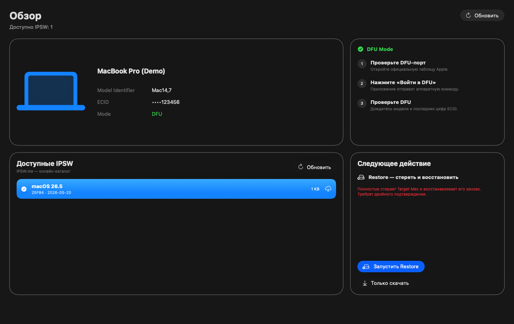
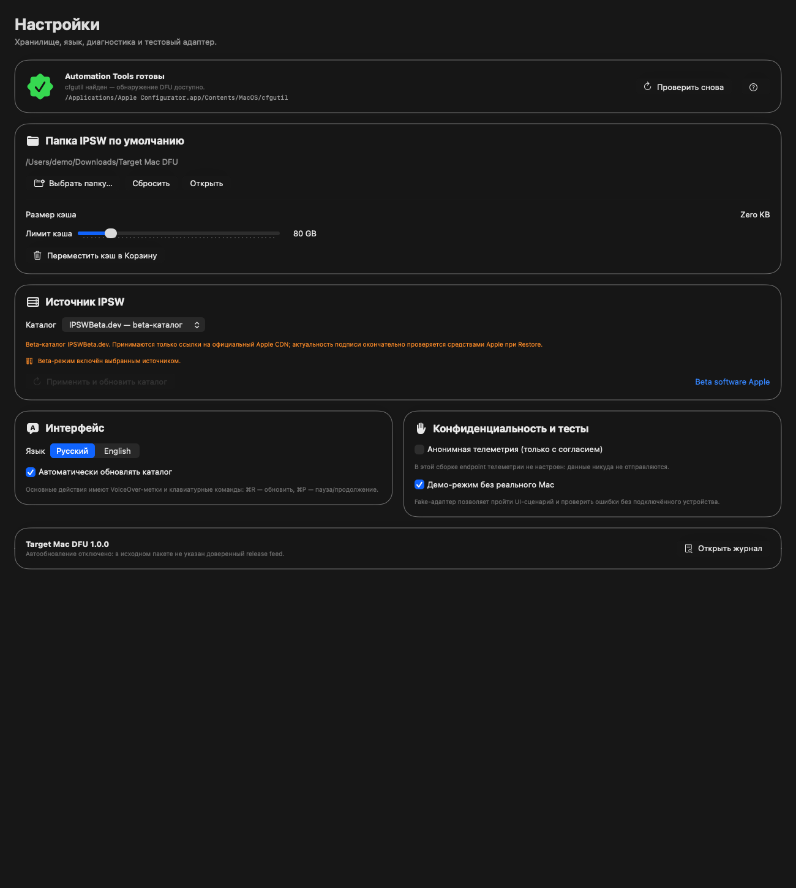

# Target Mac DFU

**English** · [Русский](README.md)

[](https://github.com/Sampsih/target-mac-dfu/actions/workflows/build.yml)
[](https://github.com/Sampsih/target-mac-dfu/releases/latest)

[](LICENSE)

A macOS utility that puts a connected Mac into DFU mode with one click, finds and downloads a compatible IPSW, and performs a full Restore.



> [!CAUTION]
> Restore completely erases the target Mac. Confirm that you selected the correct computer and backed up all important data before proceeding.

## Features

- one-click DFU entry through `macvdmtool`;
- DFU detection with Model Identifier and ECID verification;
- signed IPSW discovery plus a separate beta firmware source;
- download progress, speed, pause and resume;
- configurable IPSW storage folder;
- full Restore with two-step confirmation;
- operation history, logs and a diagnostic support bundle;
- Russian and English interface;
- demo mode that does not require a connected Mac.

## Screenshots

| One-click DFU | IPSW sources and settings |
| --- | --- |
|  |  |

## Quick start

1. Download `Target-Mac-DFU-1.0.0.zip` from **Releases**.
2. Move `Target Mac DFU.app` to **Applications**.
3. Install Apple Configurator and Automation Tools if prompted.
4. Connect the host Mac directly to the correct DFU port on the target Mac with a data-capable USB-C cable.
5. Open **DFU Mode** and click **Send Mac to DFU**.
6. After the model and ECID appear, select an IPSW and click **Start Restore**.
7. Do not disconnect the cable or power until the operation finishes.

See the Russian documentation for [installation](docs/INSTALLATION.md), the [user guide](docs/USER_GUIDE.md), and [troubleshooting](docs/TROUBLESHOOTING.md).

## Requirements

- Apple silicon host Mac;
- macOS 14 or later;
- Apple Configurator with Automation Tools (`cfgutil`);
- Xcode Command Line Tools for automatic `macvdmtool` installation;
- a data-capable USB-C cable connected directly without a hub;
- the correct DFU port on the target Mac.

## Build from source

```bash
./scripts/build.sh
```

The application is created at `dist/Target Mac DFU.app`. To package it:

```bash
./scripts/package.sh
```

## Firmware sources

The app supports IPSW.me, a custom JSON endpoint, a local catalog, and the IPSWBeta.dev beta catalog. The beta catalog accepts only links hosted on official Apple CDNs. Apple tools make the final firmware eligibility decision during Restore.

## Security and limitations

- this is an independent project and is not affiliated with Apple Inc.;
- the administrator password is handled by the macOS system dialog and is never stored;
- telemetry is disabled by default and no data collection endpoint is configured;
- automatic DFU depends on the model, cable, port, and state of both Macs;
- Apple, macOS, Mac, and Apple Configurator are trademarks of Apple Inc.

Please follow [SECURITY.md](SECURITY.md) to report a vulnerability.

## Support the project

[](https://buymeacoffee.com/sampsih)

TON mainnet address:

```text
UQBDpkQH_ryzYKm5iiBQLuFz32SJllk4WI3drZfjQCYFHKX4
```

[Open a transfer in a TON wallet](ton://transfer/UQBDpkQH_ryzYKm5iiBQLuFz32SJllk4WI3drZfjQCYFHKX4?text=Thanks%20for%20Target%20Mac%20DFU) · [Verify the address in TON Viewer](https://tonviewer.com/UQBDpkQH_ryzYKm5iiBQLuFz32SJllk4WI3drZfjQCYFHKX4)

Always compare the address shown in your wallet with the address above before confirming a transfer.

## License

The project is available under the [MIT License](LICENSE). The optionally downloaded `macvdmtool` project has its own license and is maintained by its respective authors.
