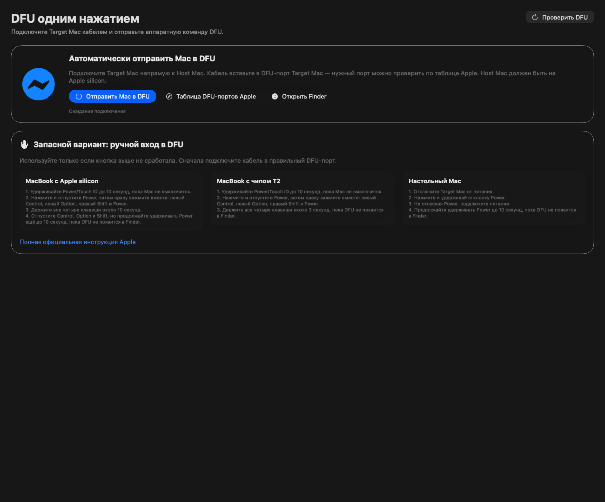

# Target Mac DFU

[](https://github.com/Sampsih/target-mac-dfu/actions/workflows/build.yml)
[](https://github.com/Sampsih/target-mac-dfu/releases/latest)

[](LICENSE)

Приложение для macOS, которое помогает отправить подключённый Mac в режим DFU одной кнопкой, подобрать и скачать IPSW, а затем выполнить полный Restore.



> [!CAUTION]
> Restore полностью удаляет данные с восстанавливаемого Mac. Перед запуском убедитесь, что выбран правильный компьютер и важные данные сохранены.

## Возможности

- автоматическая отправка Target Mac в DFU через `macvdmtool`;
- проверка появления устройства, Model Identifier и ECID;
- поиск подписанных IPSW и отдельный источник beta-версий;
- загрузка IPSW с процентом, скоростью, паузой и продолжением;
- выбор папки для хранения IPSW;
- полный Restore с двойным подтверждением;
- история операций, журналы и диагностический архив;
- русский и английский интерфейс;
- демо-режим для знакомства без подключённого Mac.

## Быстрый старт

1. Скачайте `Target-Mac-DFU-1.0.0.zip` из раздела **Releases**.
2. Переместите `Target Mac DFU.app` в папку **Applications**.
3. Установите Apple Configurator и Automation Tools, если приложение попросит.
4. Подключите Host Mac к правильному DFU-порту Target Mac напрямую USB-C кабелем.
5. Откройте **Режим DFU** и нажмите **Отправить Mac в DFU**.
6. После появления модели и ECID выберите IPSW и нажмите **Запустить Restore**.
7. Не отключайте кабель и питание до завершения операции.

Подробности: [установка](docs/INSTALLATION.md) · [руководство пользователя](docs/USER_GUIDE.md) · [решение проблем](docs/TROUBLESHOOTING.md)

## Требования

- Host Mac с Apple silicon;
- macOS 14 или новее;
- Apple Configurator с Automation Tools (`cfgutil`);
- Xcode Command Line Tools для автоматической установки `macvdmtool`;
- USB-C кабель с передачей данных и прямое подключение без хаба;
- правильный DFU-порт восстанавливаемого Mac.

## Сборка из исходников

```bash
./scripts/build.sh
```

Готовое приложение появится в `dist/Target Mac DFU.app`. Для создания ZIP:

```bash
./scripts/package.sh
```

## Источники прошивок

Приложение поддерживает IPSW.me, пользовательский JSON-каталог, локальный каталог и beta-каталог IPSWBeta.dev. Для beta-каталога принимаются только ссылки на официальные CDN Apple. Фактическую возможность установки прошивки окончательно проверяют инструменты Apple во время Restore.

## Безопасность и ограничения

- приложение не является продуктом Apple и не связано с Apple Inc.;
- пароль администратора обрабатывается системным окном macOS и не сохраняется;
- телеметрия по умолчанию выключена, endpoint отправки данных не настроен;
- автоматический DFU зависит от модели, кабеля, порта и состояния обоих Mac;
- названия Apple, macOS, Mac и Apple Configurator являются товарными знаками Apple Inc.

О найденной уязвимости сообщайте по инструкции в [SECURITY.md](SECURITY.md).

## Лицензия

Исходный код распространяется по лицензии [MIT](LICENSE). Загружаемый при необходимости проект `macvdmtool` имеет собственную лицензию и сопровождается отдельно его авторами.
